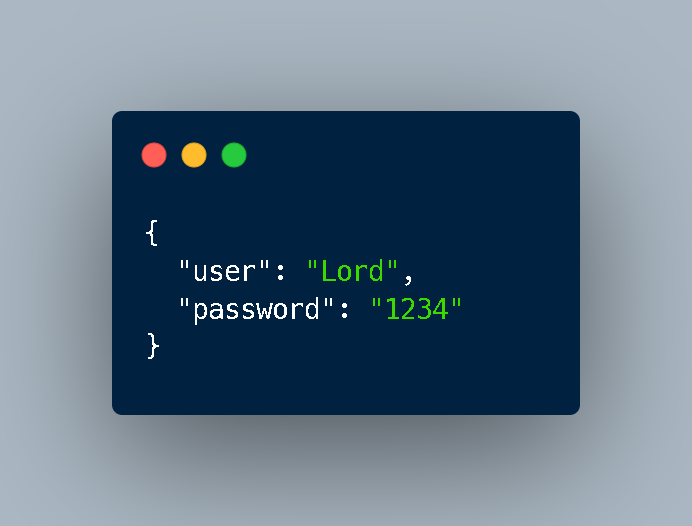

# Auto-Register-Heromc

Tự động điền thông tin và đăng kí account cho server heromc.net

## Installation (Cài đặt)

Vào server https://discord.gg/gzWSyRR6zS để biết cách cài đặt!

Nếu đã vào server rồi thì vào [channel này](https://discord.com/channels/991243015010127914/1086989148650483802)

## settings.json
username là tên trong minecraft của bạn muốn generate, password là password mà bạn muốn để login trong server.
Ví dụ:

## TODO

- Thêm requirements.txt
- Thêm phần giải

## Contributing ( Đóng góp )

Xin vui lòng dms tunglamnoob#6719 để đóng góp. Xin cảm ơn!

Fork & Pull request?

Hiện đang cần người có am hiểu về captcha

## Contributors

- [anhtlauncher](https://github.com/anhtlauncher): README.md, 1 số thứ
- Dante : Autoreg base
- [tunglamnoob](https://github.com/tunglamnoob6719): Publisher, cũng 1 số thứ và tutorial trong discord
- RiceUser : Codes

## Based on [GNU General Public License v3.0](https://github.com/tunglamnoob6719/Auto-Reg-Heromc/blob/main/LICENSE)

DM skidders
